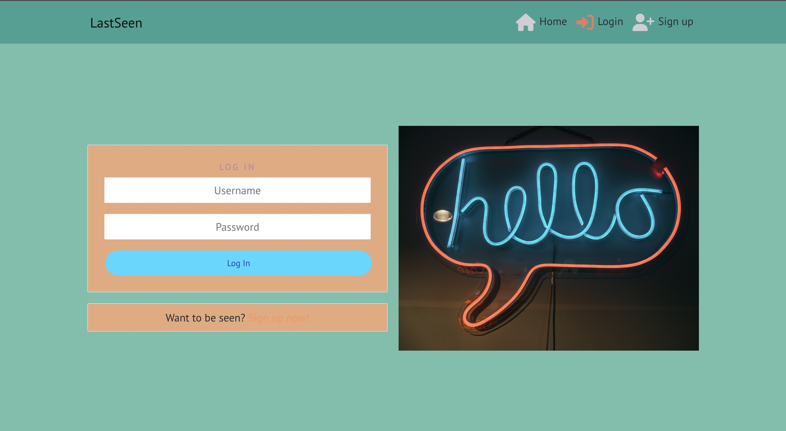
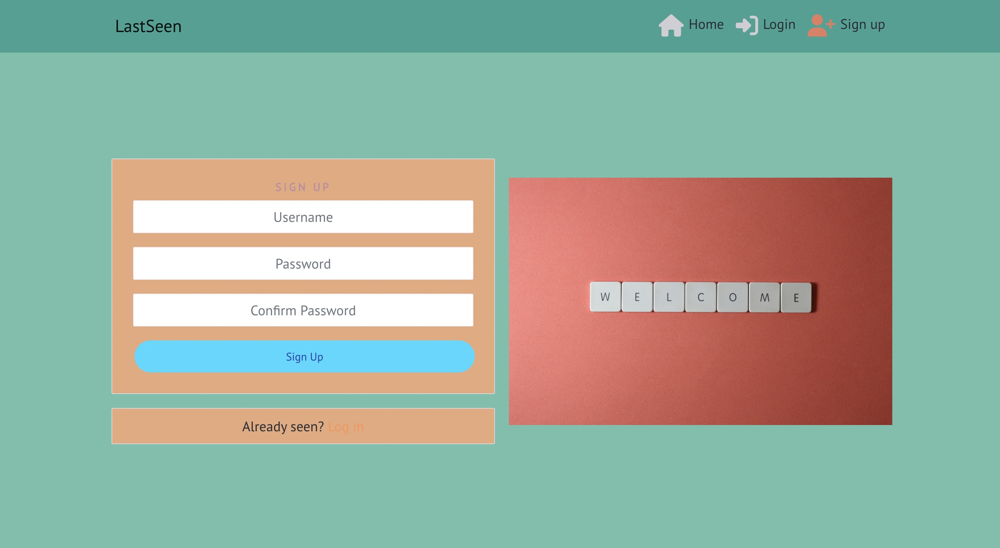
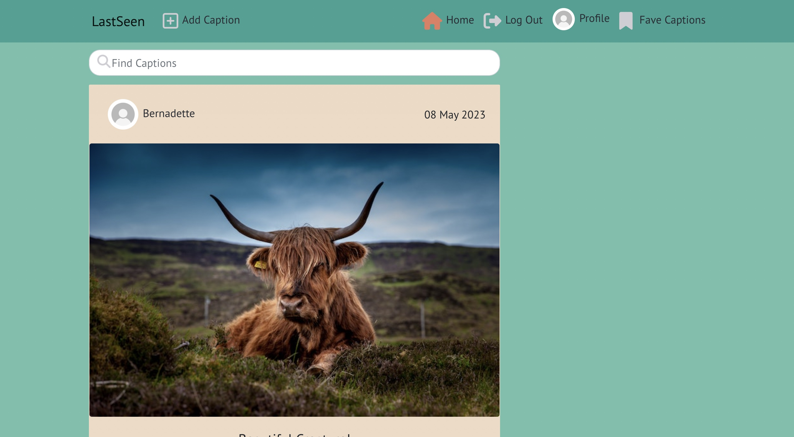
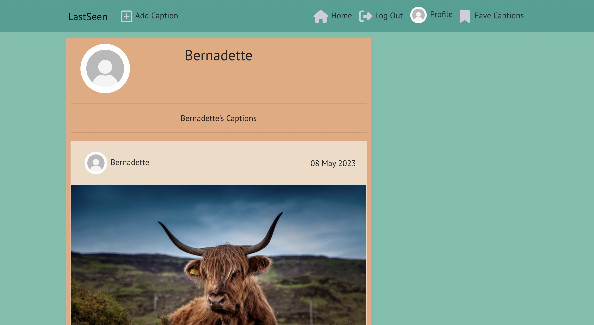
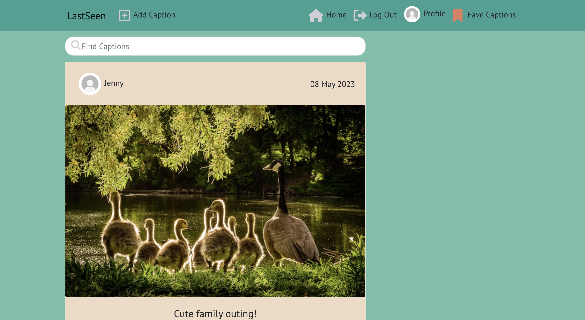
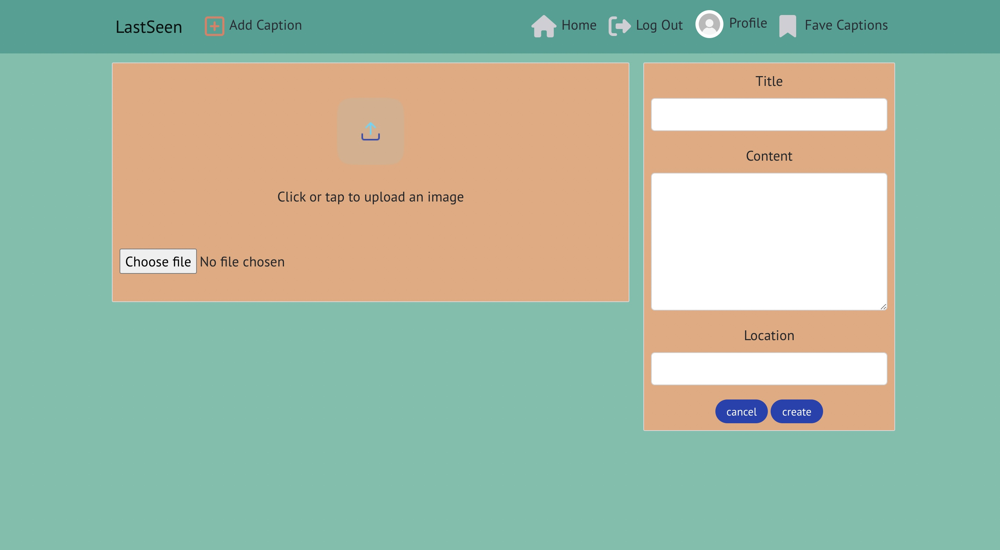
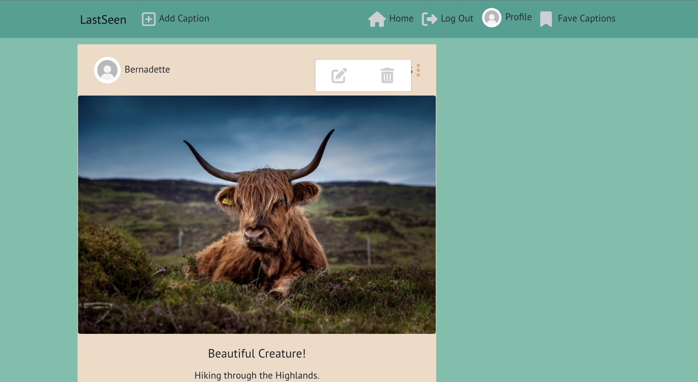
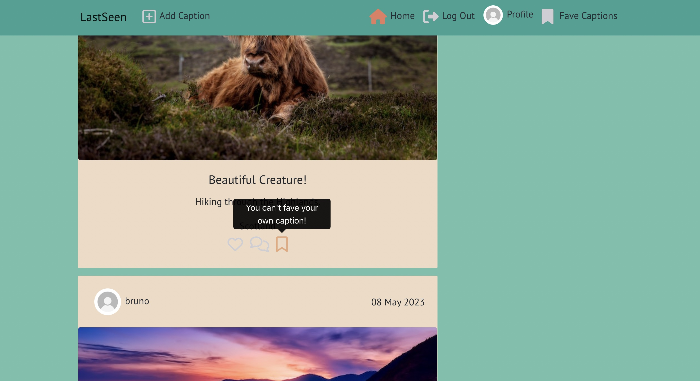
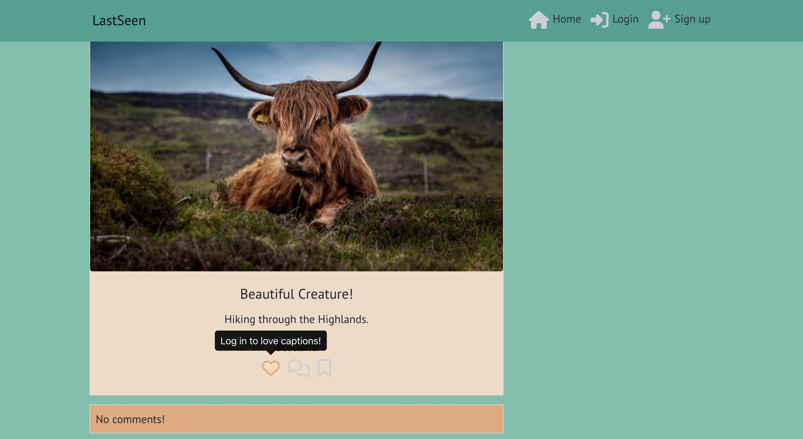

# Last Seen 

This is a social media image sharing site that allows users to create, read, update and delete captions and comments that have been posted to a user's profile.

Please click link to live site [here](https://last-seen.herokuapp.com/).

<h2 align ="center"></h2>

## User Stories 

I used the Agile Methodology Tool on Github to plan my project and use as a to do list. I labelled tasks with Must Have and Should Have and moved the issues I was working on across the board from the To Do column to the In Progress column. Completed issues would then be dragged across to the Done column.  

- As a user, I want to be able to view a NavBar on all pages of the site to allow easy navigation across it.  

- As a user, I want to be able to see my logged in/out status by looking at the links on the NavBar.

- As a user, I want the option to create an account or log in to an existing account so that I can interact with captions I can see.

- As a user, I want to be able to create a caption for other users to see.

- As a user, I want to be able to see when captions were created so I can keep up to date with the content.

- As a user, I want to be able to love, fave and comment on captions by other users to interact.

- As a user with an account, I want to be able to delete or edit a caption and love/unlove/fave/unfave a caption.

- As a user, I want to be able to visit another user's profile so I can see all of their captions.

- As a user, I want to be able to search captions by title or username so I can find specific captions.

- As a user, I want the captions and comments to keep loading as I scroll through for a better user experience.

## Another user story has been added to my issues/project for my new model - Fave.  The already existing issues have not been updated to reflect my post model changing to caption model.  
<h2 align ="center"></h2>

# Wireframes

The project has developed a bit more since these Wireframes were created.

## Home Page

<h2 align ="center"></h2>

## Home Page Logged In

<h2 align ="center"></h2>

## Create a Caption

<h2 align ="center"></h2>

## Login

<h2 align ="center"></h2>

## Sign Up

<h2 align ="center"></h2>

# Features 

## Log in

Users can log into their account from here or users without an account can choose to browse the captions on the home page or sign up to create an account either via the NavBar or Want to be Seen link under the log in form.  

<h2 align ="center"></h2>

## Sign up

Users can create an account with a password by completing the sign up form

<h2 align ="center"></h2>

## Home

Once logged in, users are taken to the home page which displays all user's captions.  New links are added to the NavBar to give the user the option to Add a Caption, Log Out, go to their own Profile page or see the captions they have added to Fave Captions.  

<h2 align ="center"></h2>

## Nav Bar and Search 

The Nav Bar indicates to the user which link/page they are on by appearing orange in colour.  The search filter allows users to find a caption by either the title or username of the owner of the caption.

<h2 align ="center"></h2>

## Profile 

The profile page shows a user their own captions

<h2 align ="center"></h2>

## Fave Captions

The fave captions page displays all captions that the logged in user has added to their faves.  The bookmark icon under the post will be solid in colour if the user has added to their faves.

<h2 align ="center"></h2>

## Add Caption

Allows a logged in user to upload an image and complete a form to create a caption with details such as a title, content and location.

<h2 align ="center"></h2>

## Edit Caption

When a caption is clicked on, a logged in user has the option to edit/delete it.  They can also add a comment or edit/delete it.

<h2 align ="center"></h2>

## Love, Comment, Fave

A logged in user can love and fave any caption except their own and will receive a warning that they can't love or fave their own caption.  They do have the ability to comment on their own captions though.  A logged out user will not have the ability to interact with any caption by love, fave or comment.  Much like the bookmark icon, the heart icon will also be solid in colour if a user loves a caption.

### Logged in
<h2 align ="center"></h2>

### Logged out
<h2 align ="center"></h2>

# Testing

### As a user, I want to be able to view a NavBar on all pages of the site to allow easy navigation across it. 
- The NavBar is visible on all pages for logged in and logged out users without any issues.

### As a user, I want to be able to see my logged in/out status by looking at the links on the NavBar.
- Log In/Sign Up appears on NavBar for logged out users and Log Out appears for logged in users without any issues.

### As a user, I want the option to create an account or log in to an existing account so that I can interact with captions posted by other users that I can see.
- The NavBar has the option to log in or sign up to create an account and all is working as expected.

### As a user, I want to be able to create a caption for other users to see.
- Captions can be created and displayed for users to view

### As a user, I want to be able to see when captions were created so I can keep up to date with the content.
- Captions that are posted have a created on date displayed

### As a user, I want to be able to love, fave and comment on captions by other users to interact.
- Logged in users are able to comment, love and fave posts as expected. Logged out users are prompted to log in to love, fave or comment.

### As a user with an account, I want to be able to delete, edit or unlove a caption or comment I create.
- The site has the functionality for logged in users to delete or edit their own captions/comments and unlove other users captions that they had previously loved.

### As a user, I want to be able to search captions by the caption title or profile username so I can find specific captions.
- The search function is working and there is a no results message if no captions are found that match the keywords entered in the search box.

### As a user, I want the captions and comments to keep loading as I scroll through for a better user experience.
- Infinite scroll exists and works on captions and comments.

The admin of my api site can see all captions/comments/faves and loves in the backend.  Captions can also be added from the backend and appear at the frontend.

# Resolved Bugs/Issues
- The biggest issue I had was all captions and all comments were displaying under every profile and every caption.  I discovered this was because I had not added the data filtering function to my Comments and Captions views.py in my api.  

# ESLint
- Installed Eslint in Gitpod and had a number of errors re prop-types so added a react/prop-types rule that I found on Slack for the same issue and now these are the only errors I can see:

<h2 align ="center"></h2>

## Note:  Eslint started causing a number of compiling issues for me so tutor support suggested I uninstall it completely as it is already built into the react app and I didn't need the other version.  I uninstalled the other version and my project was able to compile again with no issues.

# Deployment
- This React application is deployed to Heroku. Please follow the steps below:

- Fork or clone this repository in GitHub

- Log in to Heroku

- Click on 'New' and select 'Create new app' from the dropdown

- Enter a name for the app and select the appropriate region

- Select 'Create app'

- Click on 'Settings'

- Select 'GitHub' and confirm you wish to deploy using GitHub

- Find the 'Connect to GitHub' section and use the search box to locate relevant repo

- Select 'Connect'

- If you would like your site to be automatically deployed with each change that is pushed to Github, choose the 'main' branch under 'Automatic Deploys' and select 'Enable Automatic Deploys'

- Alternatively, you can select 'Manual Deploy' below and choose 'main' as the branch to deploy and select 'Deploy Branch'. Your site will only be manually deployed when you choose

- Once the deployment process is complete, you will be able to click on a link to your deployed site

## Reuse of React Components 

- Code from the Caption Create Form was reused for the Caption Edit Form and Comment Edit Form.
- Asset: This component is used for spinners throughout the site and user messages are displayed if search results are not found.

## Future Features 
- Users will be able to follow each other
- Users will be able to update their profiles/profile pictures
- Users will be able to view most popular profiles 

# Technologies Used:
- Pexels - used for images on the site
- FontAwesome - used for icons 
- CSS - used for styling 
- HTML 
- Javascript
- Bootstrap
- React 
- Heroku
- Gitpod
- Github

# To connect the front end site to the back end on Heroku and Gitpod:
- Add new config var to API on Heroku called CLIENT_ORIGIN with a value of the url for the deployed React project

- Add a CLIENT_ORIGIN_DEV key with the value of your Gitpod preview link

- Now we need to tell our React project to send requests to the API

- To do this, install the Axios Library in your Gitpod workspace 

- Create an api folder with an axiosDefaults file inside it and import axios

- Now add base_URL of your deployed API project

- Set the content-type header to multipart/form-data

- Set withCredentials to true

- Import them into App.js

# Credit
- Code Institute Moments Walkthrough
- Mentor
- Tutoring Support 
- Slack 
- Stackoverflow

