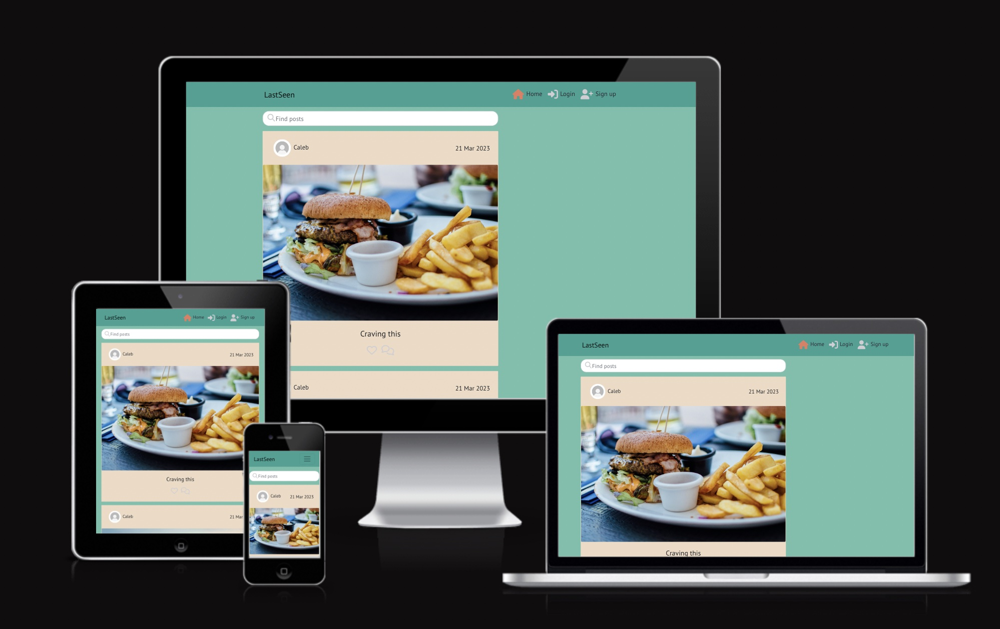
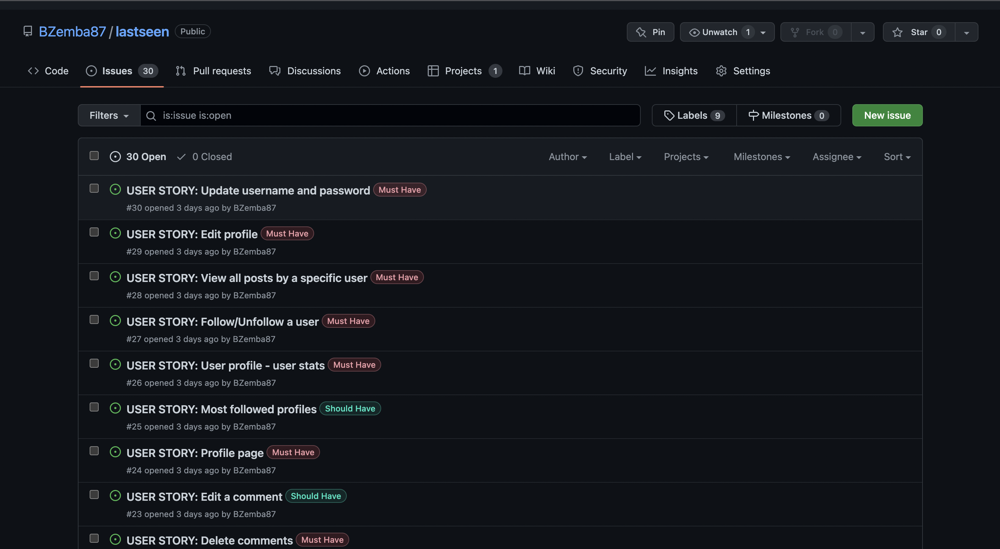
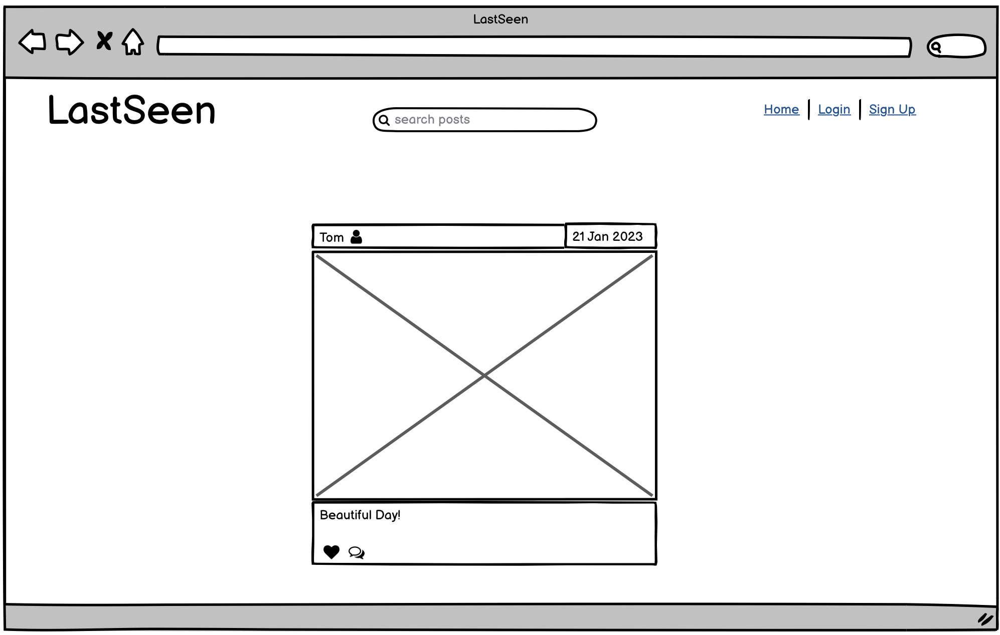
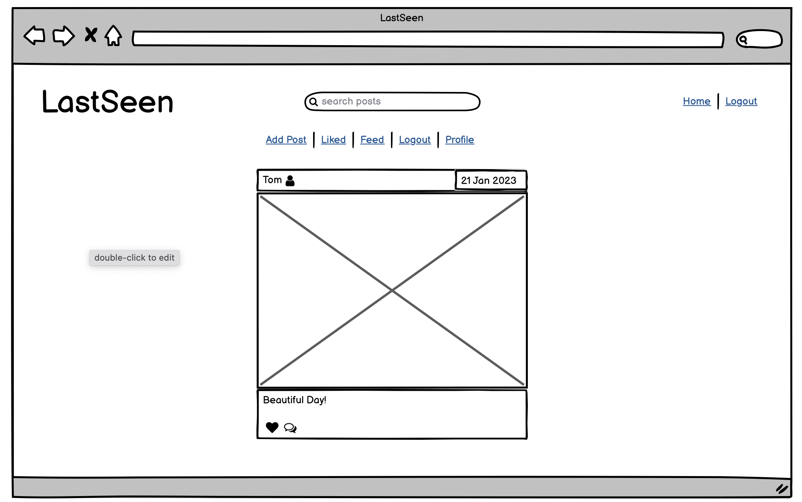
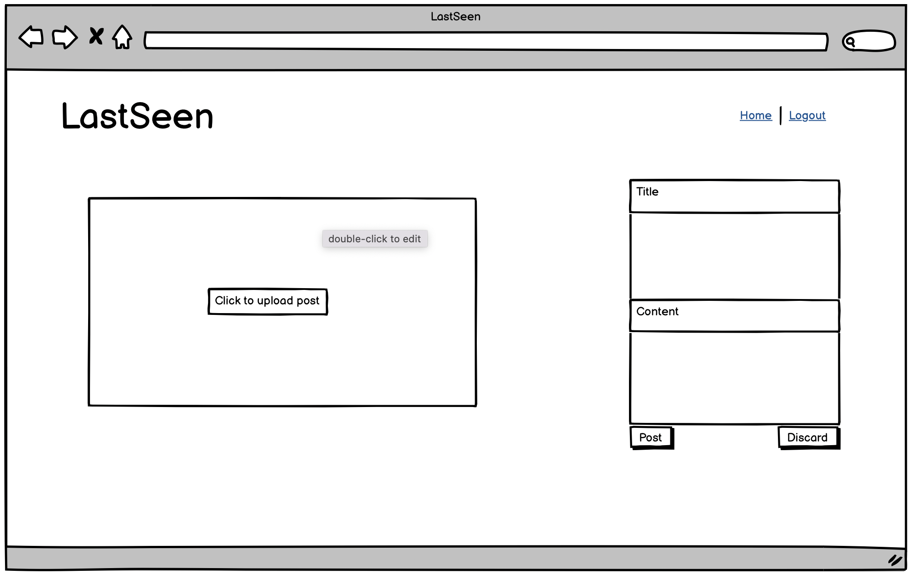
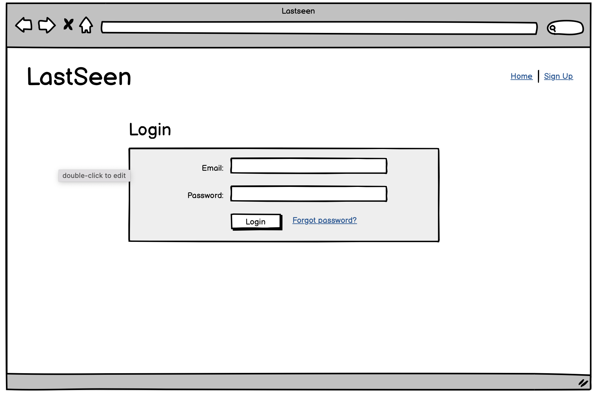
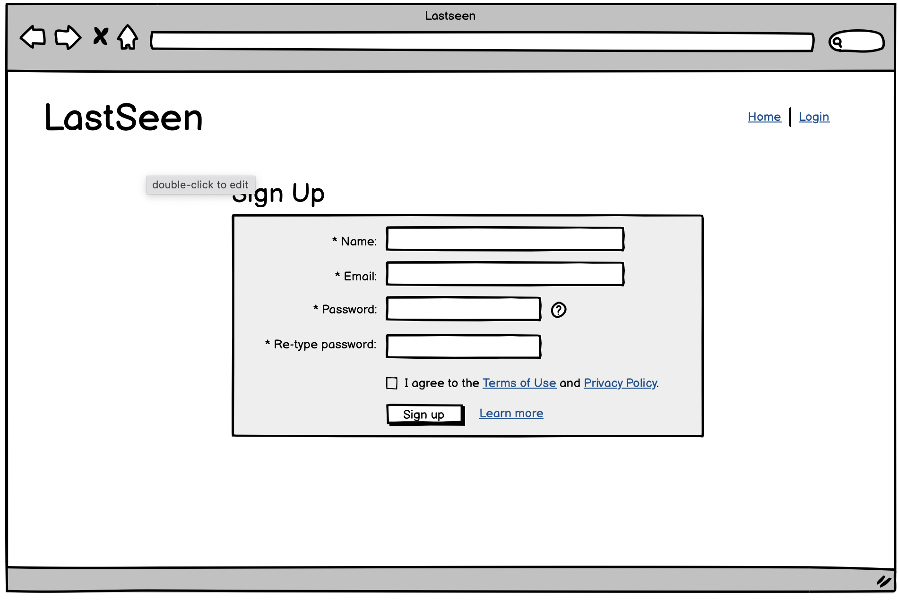
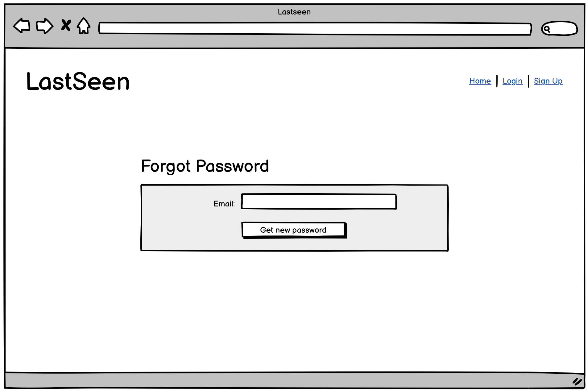
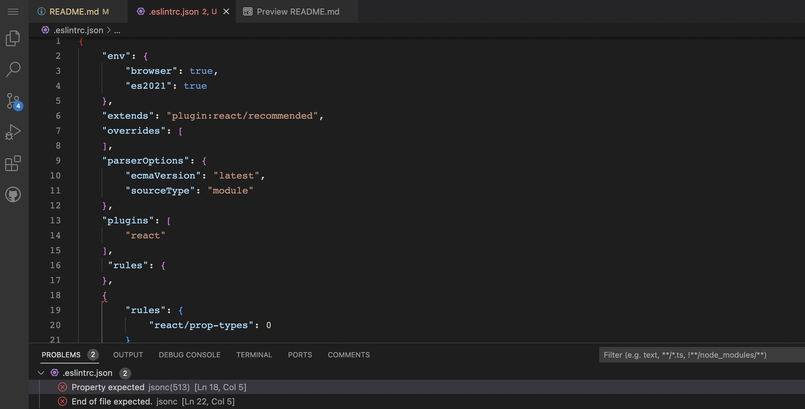

# Last Seen 

This is a social media image sharing site that allows users to create, read, update and delete posts, comments, likes and profiles.

Please click link to live site [here](https://last-seen.herokuapp.com/).

<h2 align ="center"></h2>

## User Stories 

I used the Agile Methodology Tool on Github to plan my project and use as a to do list. I labelled tasks with Must Have and Should Have and moved the issues I was working on across the board from the To Do column to the In Progress column. Completed issues would then be dragged across to the Done column.  

- As a user, I want to be able to view a NavBar on all pages of the site to allow easy navigation across it.  

- As a user, I want to be able to see my logged in/out status by looking at the links on the NavBar.

- As a user, I want the option to create an account or log in to an existing account so that I can interact with posts I can see.

- As a user, I want to be able to create a post for other users to see.

- As a user, I want to be able to see when posts were created so I can keep up to date with the content.

- As a user, I want to be able to like and comment on posts by other users to interact.

- As a user with an account, I want to be able to delete, edit or unlike a post.

- As a user, I want to be able to visit another user's profile so I can see all of their posts.

- As a user, I want to be able to search posts so I can find specific posts.

- As a user, I want the posts and comments to keep loading as I scroll through for a better user experience.

<h2 align ="center"></h2>

# Wireframes

## Home Page

<h2 align ="center"></h2>

## Home Page Logged In

<h2 align ="center"></h2>

## Create a Post

<h2 align ="center"></h2>

## Login

<h2 align ="center"></h2>

## Sign Up

<h2 align ="center"></h2>

## Forgot Password

<h2 align ="center"></h2>

# Testing

### As a user, I want to be able to view a NavBar on all pages of the site to allow easy navigation across it. 
- The NavBar is visible on all pages for logged in and logged out users

### As a user, I want to be able to see my logged in/out status by looking at the links on the NavBar.
- Log In/Sign Up appears on NavBar for logged out users and Log Out appears for logged in users.

### As a user, I want the option to create an account or log in to an existing account so that I can interact with posts I can see.
- The NavBar has the option to log in or sign up to create an account.

### As a user, I want to be able to create a post for other users to see.
- Posts can be created and displayed for users to view

### As a user, I want to be able to see when posts were created so I can keep up to date with the content.
- Posts have a created on date

### As a user, I want to be able to like and comment on posts by other users to interact.
- Logged in users are able to comment and like posts, logged out users are prompted to log in to like or comment.

### As a user with an account, I want to be able to delete, edit or unlike a post.
- The site has the functionality for logged in users to delete or edit their own posts and unlike other users posts that they had previously liked.

### As a user, I want to be able to search posts so I can find specific posts.
- The search function is working and there is a no results message if no posts match the search.

### As a user, I want the posts and comments to keep loading as I scroll through for a better user experience.
- Infinite scroll exists on posts and comments.

# Known Issues
- The same comments are displaying under all posts
- The same posts are displaying on all profile pages

# ESLint
- Installed Eslint in Gitpod and had a number of errors re prop-types so added a react/prop-types rule that I found on Slack for the same issue and now these are the only errors I can see:

<h2 align ="center"></h2>

# Deployment
- This React application is deployed to Heroku. Please follow the steps below:

- Fork or clone this repository in GitHub

- Log in to Heroku

- Click on 'New' and select 'Create new app' from the dropdown

- Enter a name for the app and select the appropriate region

- Select 'Create app'

- Click on 'Settings'

- Select 'GitHub' and confirm you wish to deploy using GitHub

- Find the 'Connect to GitHub' section and use the search box to locate relevant repo

- Select 'Connect'

- If you would like your site to be automatically deployed with each change that is pushed to Github, choose the 'main' branch under 'Automatic Deploys' and select 'Enable Automatic Deploys'

- Alternatively, you can select 'Manual Deploy' below and choose 'main' as the branch to deploy and select 'Deploy Branch'. Your site will only be manually deployed when you choose

- Once the deployment process is complete, you will be able to click on a link to your deployed site

# Technologies Used:
- Pexels
- FontAwesome
- HTML
- CSS
- Javascript
- Bootstrap
- React 

# To connect the front end site to the back end on Heroku and Gitpod:
- Add new config var to API on Heroku called CLIENT_ORIGIN with a value of the url for the deployed React project

- Add a CLIENT_ORIGIN_DEV key with the value of your Gitpod preview link

- Now we need to tell our React project to send requests to the API

- To do this, install the Axios Library in your Gitpod workspace 

- Create an api folder with an axiosDefaults file inside it and import axios

- Now add base_URL of your deployed API project

- Set the content-type header to multipart/form-data

- Set withCredentials to true

- Import them into App.js

# Credit
- Code Institute Moments Walkthrough
- Mentor
- Tutoring
- Slack 

